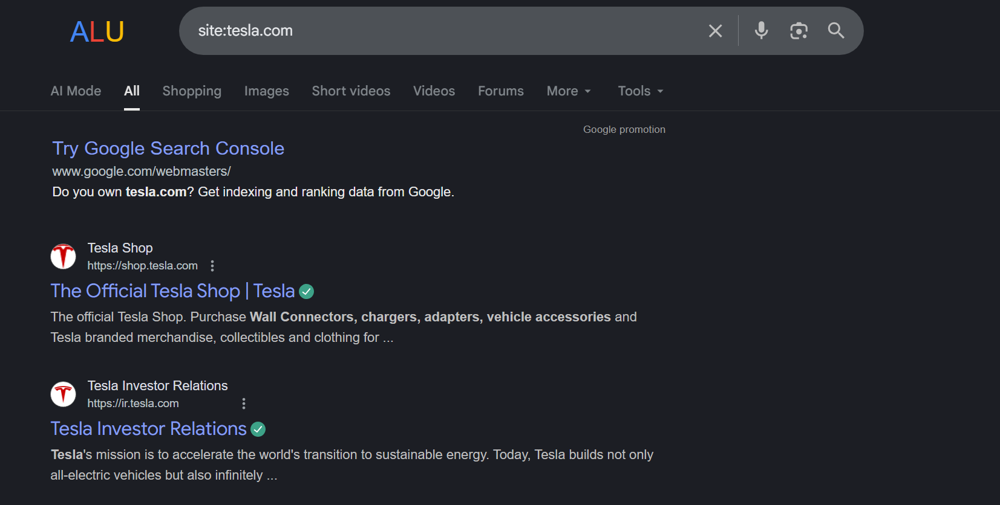
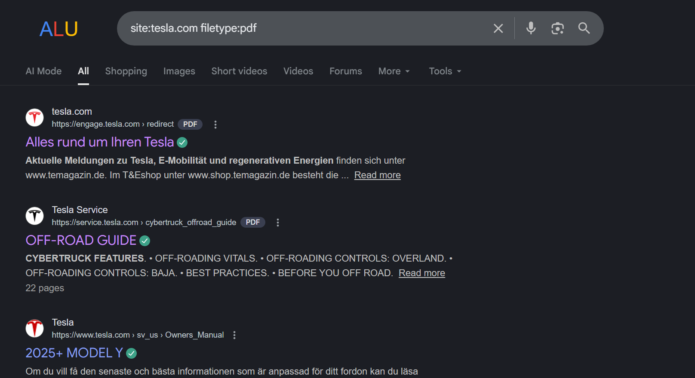
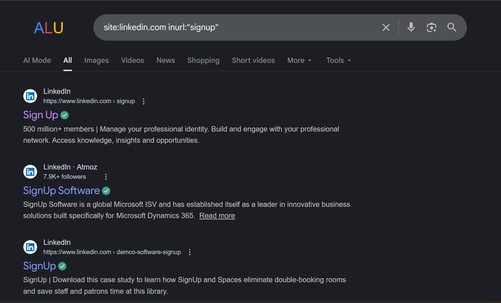
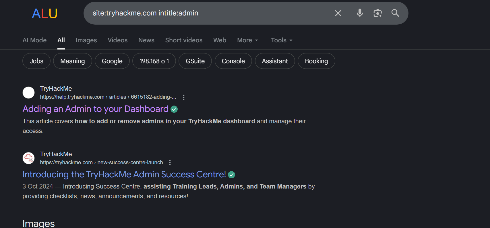

# 🔍 Google Dorking Playbook


A practical and ethical playbook for using Google Dorks in:
- Security reconnaissance
- Bug bounty programs
- OSINT investigations
- Educational research

> ⚠️ This repository is for **educational and authorized security testing only**.

---

## 📌 What is Google Dorking?
Google Dorking (Google Hacking) is the use of advanced search operators
to discover exposed information indexed by search engines.

---


## 📊 Google Dorking Command Table

You can paste this directly into `README.md` or a separate `google-dorks-table.md`.

```md
| Category | Google Dork | Description |
|--------|------------|-------------|
| Basic | site:example.com | Search within a specific website |
| Basic | intitle:"index of" | Find directory listings |
| Basic | inurl:admin | URLs containing "admin" |
| Basic | intext:"confidential" | Pages containing sensitive text |
| File Discovery | filetype:pdf | Find PDF files |
| File Discovery | filetype:xls | Find Excel files |
| File Discovery | filetype:doc OR filetype:docx | Find Word documents |
| File Discovery | filetype:sql | Find database dump files |
| File Discovery | filetype:env | Find environment config files |
| Credentials | intext:"username" intext:"password" | Possible credential exposure |
| Credentials | intext:"DB_PASSWORD" | Database passwords in plain text |
| Credentials | intext:"API_KEY" | API key exposure |
| Login Pages | inurl:login | Login pages |
| Login Pages | inurl:signin | Sign-in portals |
| Login Pages | intitle:"Admin Login" | Admin login panels |
| Admin Panels | inurl:/admin/login | Admin login endpoints |
| Admin Panels | inurl:/dashboard | Admin dashboards |
| Config Files | filetype:xml | XML configuration files |
| Config Files | filetype:yaml OR filetype:yml | YAML configuration files |
| Config Files | filetype:conf | Server config files |
| Cloud Storage | site:s3.amazonaws.com | Public AWS S3 buckets |
| Cloud Storage | site:blob.core.windows.net | Azure blob storage |
| Cloud Storage | site:storage.googleapis.com | Google Cloud storage |
| Git Exposure | intitle:"index of" ".git" | Exposed Git repositories |
| Git Exposure | filetype:git | Git-related files |
| Logs | filetype:log | Server log files |
| Logs | intext:"error" filetype:log | Error logs |
| Backup Files | filetype:bak | Backup files |
| Backup Files | filetype:old | Old backup files |
| Backup Files | filetype:zip | Compressed backups |
| Databases | filetype:db | Database files |
| Databases | filetype:sqlite | SQLite databases |
| Cameras | inurl:view/index.shtml | Live camera feeds |
| Cameras | intitle:"Live View / - AXIS" | Axis camera feeds |
| Emails | intext:"@gmail.com" site:example.com | Email harvesting |
| Emails | intext:"@yahoo.com" site:example.com | Public email exposure |
| Bug Bounty | site:example.com inurl:api | API endpoints |
| Bug Bounty | inurl:/v1 OR inurl:/v2 | API versioning |
| Bug Bounty | inurl:swagger | Swagger API docs |
| Bug Bounty | intitle:"Swagger UI" | Public API documentation |
```

---

## ⚠️ VERY IMPORTANT (don’t skip this)


```md
> ⚠️ These Google dorks are provided for **educational purposes only**.
> Use them **only on assets you own or have explicit permission to test**,
> such as bug bounty program scopes.
```

---
## 📌 EXAMPLES
```md
site:example.com
```


```md
site:tesla.com filetype:pdf
```



```md
site:linkedin.com inurl:"signup"
```



```md
site:tryhackme.com intitle:admin
```

